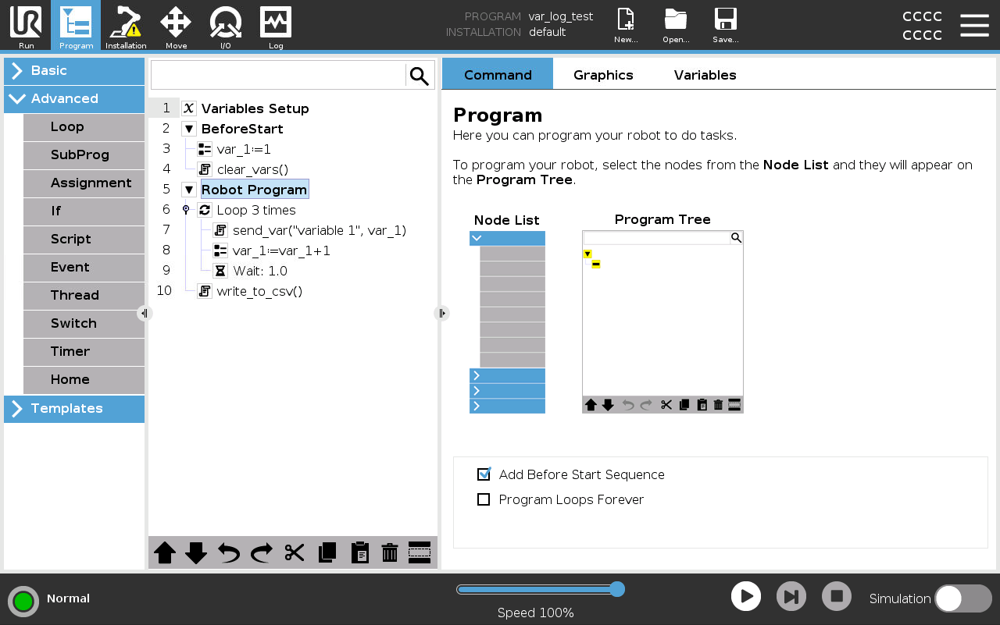

# Variable Logging
URCap sample that illustrates how to log a variable and its value in a running program. These values can then be written out to a CSV file that's stored in the "programs" folder in Polyscope.

